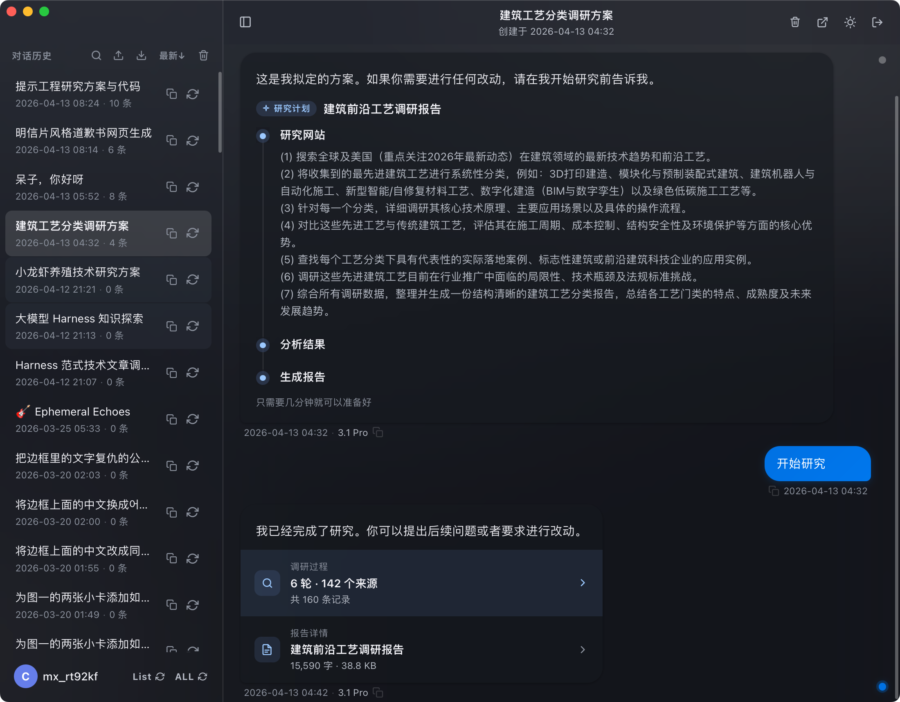
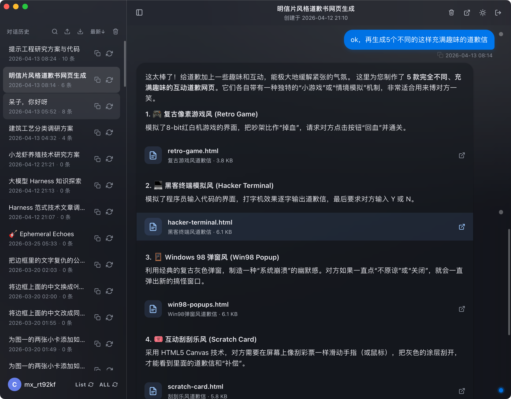
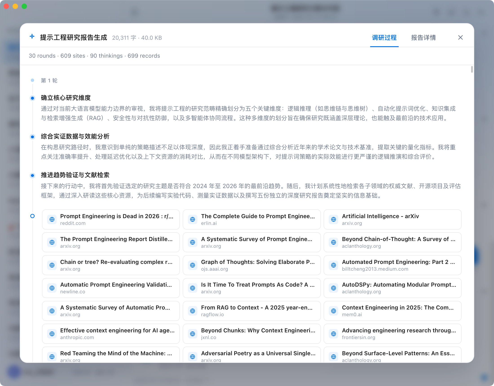
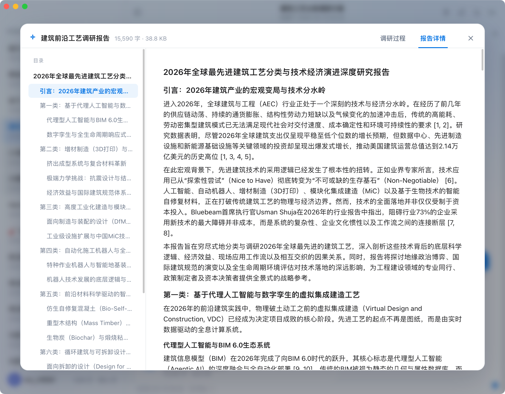

<div align="center">


# Gemini Collector

**Back up all your Google Gemini conversations & AI-generated media locally**

Native desktop app for macOS & Windows · Multi-account · Light / Dark theme

[**简体中文**](./README.zh-CN.md)


 

</div>

---

## Screenshots

<div align="center">

| Light theme | Dark theme |
|:---:|:---:|
|  |  |

| Chat view | Media messages |
|:---:|:---:|
|  |  |

| Conversation list | Export |
|:---:|:---:|
|  |  |

| Deep Research | Canvas files |
|:---:|:---:|
|  |  |

| Research progress | Research report |
|:---:|:---:|
|  |  |

</div>

---

## Features

**Zero-config sync**
- **macOS**: automatically detects all Gemini accounts signed in to Chrome — one-click sync, no setup needed
- **Windows**: sign in via the built-in browser on first launch, then sync automatically
- Multi-account support with independent management, incremental updates, and resumable transfers

**Full content archival**
- Sync all conversation text with complete context
- Download user-uploaded images and videos
- Save AI-generated images, music, videos, and other media — nothing is left behind

**Reading experience**
- Native UI with automatic light / dark theme switching
- Full rendering: Markdown, syntax-highlighted code, LaTeX math
- Timeline navigation for instant access to thousands of conversations
- Right-click to delete individual conversations

**Export**
- Filter by time range (all / last 3 days / 7 days / 1 month)
- Export formats:
  - Raw data
  - [Kelivo](https://github.com/Chevey339/kelivo)
  - [Kelivo](https://github.com/Chevey339/kelivo) split packages (for iOS devices with limited single-import size)
- Preview file count and size before exporting

---

## Security & Privacy

**Everything runs locally. No data is ever uploaded.**

- **macOS**: reads local Chrome cookies for Gemini authorization — no manual login required
- **Windows**: Google sign-in via built-in WebView2 browser, cookies stored locally only
- All synced content stays on your machine — no third-party servers involved
- No account registration or extra authorization needed

---

## Install

| Platform | Status | Instructions |
|:---|:---:|:---|
| macOS | ✅ | Download the latest `.dmg` from [Releases](https://github.com/FirenzeLor/gemini-collector/releases), drag to Applications |
| Windows | ✅ | Download the latest installer from [Releases](https://github.com/FirenzeLor/gemini-collector/releases) and run it |

> **macOS "unverified developer" warning**: Go to **System Settings → Privacy & Security** and click "Open Anyway".
>
> **macOS "damaged" warning**: Run the following in Terminal, then reopen:
> ```bash
> xattr -cr /Applications/gemini-collector.app
> ```

---

## Requirements

**macOS**
- macOS 12+
- Google Chrome installed and signed in to [Gemini](https://gemini.google.com)

**Windows**
- Windows 10 (1803+) or later
- Sign in to Google within the app on first use (Chrome not required)

---

## License

[PolyForm Noncommercial License 1.0.0](./LICENSE) — free to use, modify, and share for non-commercial purposes.
