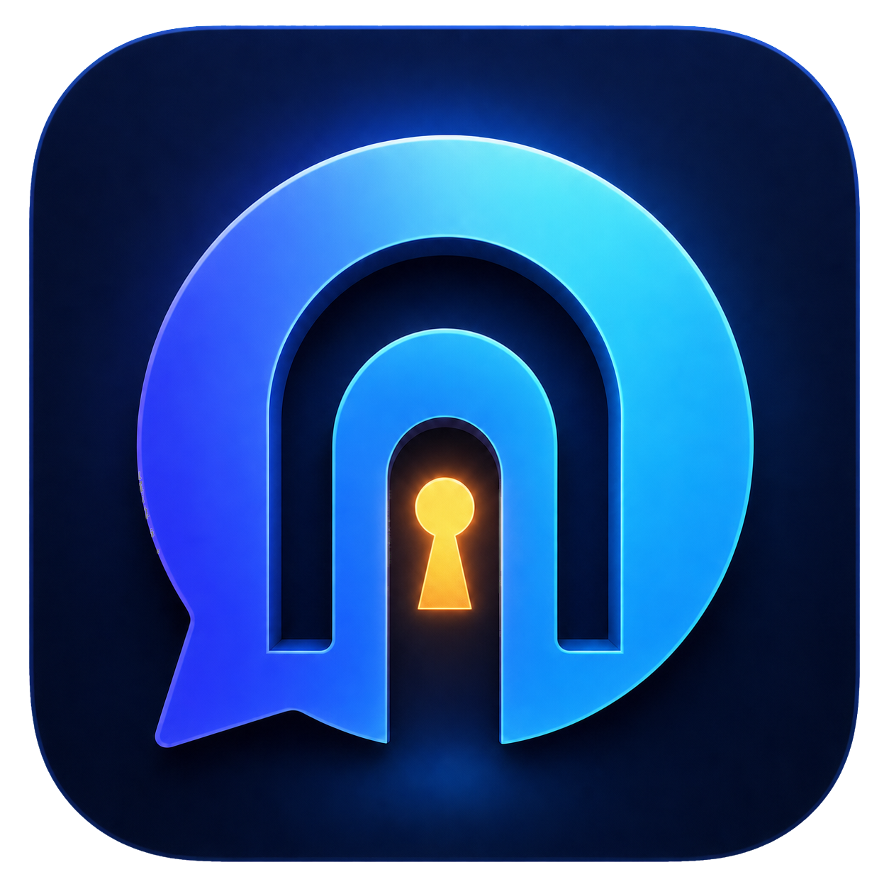

<div align="center">
  

# Chat Vault

**A private local archive and reader for Google Gemini conversations**

macOS · Windows · Multi-account · Background sync · Full-text search · Rich media · Portable export

[简体中文](./README.zh-CN.md)

[](https://github.com/yuanweize/Chat-Vault/releases)


[](./LICENSE)
</div>

Current version: **3.1.0** · [Project structure](./docs/PROJECT_STRUCTURE.md) · [Release notes](./docs/RELEASE_NOTES.md)

Chat Vault downloads your Gemini history into an on-device archive that remains useful even when a conversation disappears from the remote list. It is designed for reliable collection, fast browsing, and exporting your own data—not as a replacement Gemini client.

## Highlights

- **Reliable local sync** — list-only, per-conversation, incremental, and full-account sync with resumable jobs, cancellation, retries, and failed-media recovery.
- **Complete conversation reader** — Markdown, tables, code highlighting, LaTeX, uploads, generated images, audio/video, Canvas documents, and Deep Research plans/reports.
- **Built for large archives** — virtualized conversation and message lists, timeline grouping, local full-text search, folders, status filters, and multiple sort modes.
- **Multi-account workflow** — account discovery, fast switching, independent archives, and per-account sync state.
- **Useful exports** — conversation Markdown/ZIP, print-to-PDF, complete account ZIP, Kelivo-compatible export (including split archives), and ZIP import.
- **Local access protection** — optional PBKDF2-SHA256 password verification and inactivity-based auto-lock.
- **Consistent bilingual UI** — complete Simplified Chinese and English interface resources with system/light/dark themes.

## Platform behavior

| Platform | Authentication | Notes |
| --- | --- | --- |
| macOS | Reads the local Chrome/Chromium-family Gemini session | macOS may request Keychain and Full Disk Access permission. |
| Windows | Google sign-in in the app's WebView2 window | The resulting cookies remain on the device. |

Linux is not currently a supported release target.

## Privacy and security

- Conversation archives, search indexes, settings, and exports are stored locally.
- Chat Vault communicates directly with Google Gemini to synchronize the account selected by the user. It does not use a Chat Vault cloud service or analytics backend.
- The optional password is an **application access lock**, not disk encryption. Conversation and media files remain readable to software or users that can access your operating-system account. Use FileVault or BitLocker when encryption at rest is required.
- Password verifiers use a random salt and PBKDF2-SHA256. Existing legacy SHA-256 verifiers are migrated after a successful unlock.
- Exported ZIP, Markdown, JSON, and media files contain private conversation data. Store and share them accordingly.

## Installation

Download the newest package from [GitHub Releases](https://github.com/yuanweize/Chat-Vault/releases):

- **macOS:** open the `.dmg`, then drag Chat Vault to Applications.
- **Windows:** run the provided installer.

If macOS blocks an unsigned build, open **System Settings → Privacy & Security** and choose **Open Anyway**. For a package that macOS reports as damaged, verify that it came from this repository before running:

```bash
xattr -cr "/Applications/Chat Vault.app"
```

### Non-destructive migration from Gemini Collector

Chat Vault has its own application identifier and data directory, so it does not overwrite or modify Gemini Collector. On first launch, when Chat Vault has no real archive yet, it detects a neighboring `com.gemini-collector` data directory and asks before copying anything.

Conversation JSONL, account metadata, media, folders, and generated exports are copied. Password settings, unfinished sync state, and the old search index are not. The core archive formats are compatible, but the apps must not share one writable directory: concurrent syncs can conflict, and Chat Vault's newer Tantivy search index is incompatible with the old index. Chat Vault rebuilds its own index after migration, while the source archive remains unchanged.

## Using Chat Vault

1. Select or sign in to a Gemini account.
2. Run **List sync** to refresh conversation metadata, or **Full sync** to download all conversation content and media.
3. Browse by timeline, search the local index, or organize conversations into folders.
4. Use the conversation toolbar for Markdown/ZIP export, PDF printing, or opening the source conversation in Gemini.
5. Use the account export dialog for complete backups or Kelivo-compatible archives.

Sync and export operations can be stopped safely. A stopped or failed job may be resumed without discarding the existing local archive.

## Development

See [Project Structure](./docs/PROJECT_STRUCTURE.md) for the maintained source map and local-only paths.

### Requirements

- Node.js 20.19+ (or 22.12+)
- npm
- Current stable Rust toolchain
- [Tauri 2 system prerequisites](https://v2.tauri.app/start/prerequisites/) for your platform
- WebView2 on Windows

### Run locally

```bash
npm install
npm run tauri dev
```

The convenience scripts `./dev.sh` and `./stop.sh` restart or stop a local development instance on macOS/Linux shells.

### Quality checks

```bash
npm run check       # TypeScript type check
npm run build       # Production frontend build
npm test            # Rust unit and integration test targets
cargo fmt --manifest-path src-tauri/Cargo.toml -- --check
```

Network-dependent Gemini API integration tests are ignored by default; ordinary unit tests do not require an account.

### Production bundles

```bash
npm run tauri build
```

On macOS, `./build_dmg.sh` builds an application bundle and writes a DMG to `release/`. Release signing and notarization remain the distributor's responsibility.

## Architecture

| Area | Main paths | Responsibility |
| --- | --- | --- |
| React UI | `src/App.tsx`, `src/components/` | Accounts, navigation, reader, settings, export dialogs, and localization |
| UI foundations | `src/theme.ts`, `src/index.css`, `src/i18n.ts` | Theme tokens, reusable interaction styles, Chinese/English resources |
| Tauri commands | `src-tauri/src/lib.rs` | Desktop lifecycle and frontend command surface |
| Sync workers | `src-tauri/src/worker_host.rs`, `sync.rs`, `scheduler.rs` | Job queue, background scheduling, incremental/full sync, cancellation |
| Gemini protocol | `src-tauri/src/gemini_api/`, `protocol.rs` | Authenticated requests, response decoding, and media downloads |
| Local data | `storage.rs`, `search.rs`, `settings.rs` | JSONL archive, media, Tantivy search index, folders, and preferences |
| Import/export | `import.rs`, `legacy_migration.rs`, `export.rs` | Account backup, legacy migration, Markdown, and Kelivo conversion |

A typical local account archive contains metadata, conversation JSONL files, generated Markdown, media assets, and a rebuildable search index. Do not edit files while a sync or import job is active.

## Troubleshooting

- **No account on macOS:** confirm Gemini works in Chrome, then use **Detect accounts again**. If diagnostics mention permissions, grant the app Full Disk Access and approve the Chrome Safe Storage Keychain prompt.
- **No account on Windows:** use the in-app Google sign-in and wait until Gemini finishes loading.
- **Missing media:** synchronize that conversation again. Failed media are recorded and retried by later syncs.
- **Search looks stale:** complete a sync; the local index is updated after conversation writes and can be rebuilt from the archive.
- **An old icon or UI remains after upgrading:** fully quit every old Chat Vault process, then replace the copy in Applications with the new build. v3 clears stale WebView assets once on first launch; scripts, styles, and branding assets also use versioned filenames to prevent later upgrades from mixing resources.

## Acknowledgements

Chat Vault builds on ideas and open-source work from [FirenzeLor/gemini-collector](https://github.com/FirenzeLor/gemini-collector) and [Nagi-ovo/gemini-voyager](https://github.com/Nagi-ovo/gemini-voyager). Thank you to their authors and contributors.

## License

This repository is licensed under [GNU AGPL-3.0-only](./LICENSE). See the [commercial licensing notice](./COMMERCIAL-LICENSE.md) for important upstream-rights information; that notice does not itself grant an alternative license.
